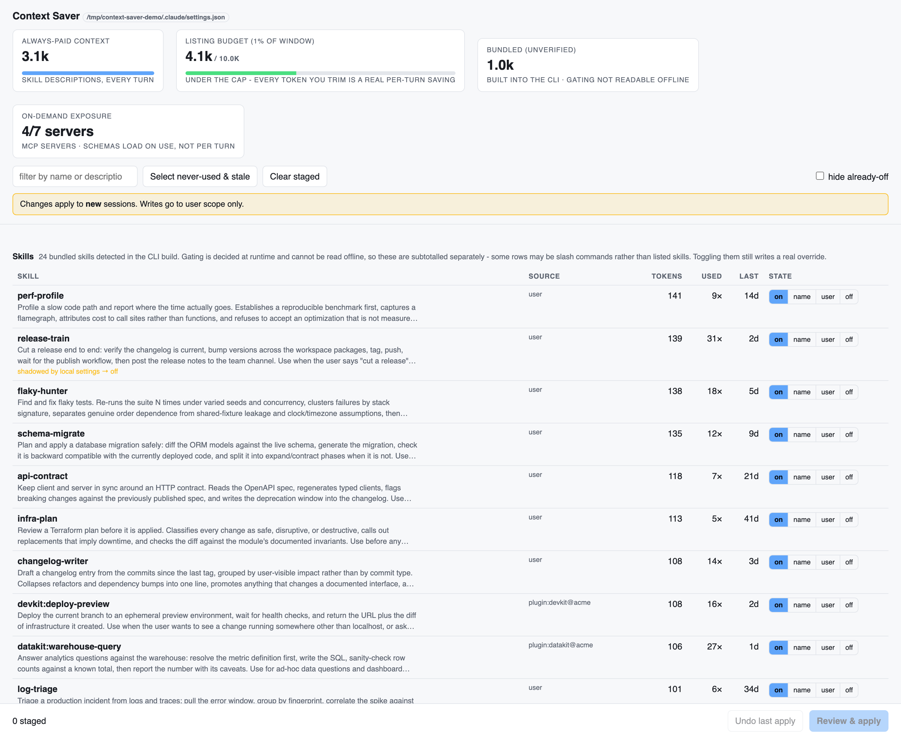

# Context Saver

A local click-click UI for cutting Claude Code's context load. It shows what every skill,
plugin and MCP server costs in **always-paid context tokens**, how often you actually use
it, and writes your choices to user-scope `~/.claude/settings.json` — with a backup, a diff
preview and one-click undo.

```bash
uv run context_saver.py           # http://127.0.0.1:8787
```

One Python file, stdlib server, embedded page. No build step, no node_modules, no network.



<sub>Screenshot uses a synthetic demo home, not real inventory.</sub>

## Why this matters

Every installed skill contributes a `- name: description` line to a listing that is
injected into **every** turn, whether or not you use it. Plugins add their skills to the
same listing. That makes context load a standing tax, and context engineering says it is
the wrong thing to pay:

- **The context window is a finite attention budget.** Tokens compete. Filling it with
  descriptions for capabilities you never invoke leaves less room — and less attention —
  for the task actually at hand.
- **More context is not better context.** Model performance degrades as irrelevant material
  accumulates. The goal is the smallest set of high-signal tokens, not the largest set of
  available options.
- **Irrelevant options are distractors.** 120 skill descriptions make it likelier that the
  model reaches for a plausible-but-wrong one. Trimming improves *targeting*, not just cost.
- **Pay on demand, not up front.** Skills are already designed for progressive disclosure:
  the listing line is always paid, the body loads only when invoked. MCP tool schemas are
  the same — deferred, so ~0 per turn. Knowing which costs are always-paid is what tells
  you where trimming actually helps.

Claude Code gives you no view of any of this. `/skills` writes its toggles to
**project-local** settings, so a change made in one directory silently doesn't apply
anywhere else; nothing shows what an item costs or whether you have ever used it; and
hand-editing `~/.claude/settings.json` risks the hooks, permissions and env living beside
it.

## What it manages

| Type | Settings key | States |
|---|---|---|
| Skills (user, plugin, bundled) | `skillOverrides` | `on` · `name-only` · `user-invocable-only` · `off` |
| Plugins | `enabledPlugins` | on / off |
| MCP servers | `disabledMcpjsonServers` | on / off |
| Bundled master switch | `disableBundledSkills` | on / off |

Those four keys are the only thing ever written; everything else in your settings file is
copied through untouched.

`name-only` keeps a skill's name visible to the model for ~4 tokens but drops its
description. `user-invocable-only` hides it from the model entirely while `/name` still
works — usually what you want for a skill you invoke deliberately.

## The meters

- **Always-paid** — user + plugin skill listing lines. The cost you pay every turn, and the
  headline savings number.
- **Listing budget** — the CLI caps the whole listing at **1% of the context window** at 4
  bytes/token (10k tokens on a 1M window). Over the cap the tail is *already* truncated to
  bare names, so trimming buys back full descriptions for the skills you kept before it
  buys back tokens. Under the cap, every token you trim is a real per-turn saving.
- **Bundled (unverified)** — built-in skills read out of the CLI build. Their runtime gating
  can't be read offline, so they are subtotalled separately and never move the headline
  number. Toggling them still writes a real override.
- **On-demand exposure** — MCP servers. Tool schemas load on use, so they cost ~0 per turn;
  this is a clutter count, deliberately **not** counted as savings.

Each row carries `usageCount` and `lastUsedAt` from Claude Code's own tracking, sortable by
tokens, usage or staleness. **Select never-used & stale** pre-stages everything unused or
older than 60 days as `user-invocable-only` — it only stages, never applies.

## Safety

- Writes go to **user scope** only, so choices apply in every project.
- Clicks stage; **Review & apply** shows the JSON diff of the managed keys and writes only
  after you confirm it.
- Timestamped backup to `~/.claude/backups/` before every write; atomic fsync+rename that
  preserves the file's mode.
- **Undo last apply** restores the managed keys only, so unrelated edits made in the
  meantime survive.
- POST requests are refused from cross-site origins and non-JSON content types — any web
  page can reach a localhost server, and this one writes your settings.
- Project/local settings that shadow a user-level value are flagged on the row, with the
  shadowing file's path.
- Changes take effect in **new** sessions.

## Notes

- First run scans the CLI build for bundled skills (~13s) and caches the result in
  `~/.claude/context-saver/bundled.json`, keyed by the build's mtime+size. Later loads are
  instant; a CLI upgrade re-scans.
- A plugin installed but absent from `enabledPlugins` is treated as **off**, matching what
  the CLI actually lists.
- `--home` (or `CONTEXT_SAVER_HOME`) points the tool at a different root; that's the seam
  the tests drive.
- `--context-window` sets the window the 1% budget is computed from (default 1,000,000);
  `/api/state?context_window=200000` does the same per request.

## Tests

```bash
python3 -m pytest -q      # 58 tests through the HTTP API against a fake home
python3 -m ruff check .
```
